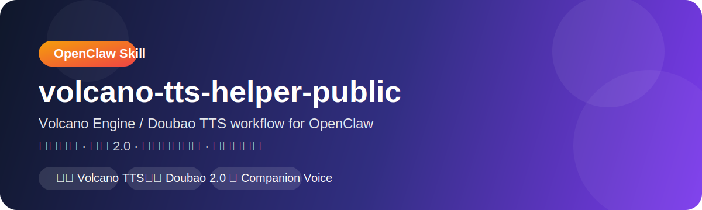

# volcano-tts-helper-public

  

> 🗣️ 一个面向 **OpenClaw** 的公开版火山引擎 / 豆包 TTS helper skill。  
> 🎙️ 用来整理 **音色映射、默认策略、本地合成脚本、2.0 能力说明**，方便自己复用，也方便别人直接拿去改。

  <strong>适合：</strong> OpenClaw 语音回复、陪伴感 TTS、情侣感语音、豆包 2.0 音色、本地 mp3 合成、可公开分享的 skill 模板

---

## 当前稳定结构

这个公开版现在采用一套更稳的 OpenClaw 集成方式：

- `plugins.entries.volcengine-tts` 只保留 `enabled: true`
- 真正的火山 TTS 参数统一放在 `messages.tts.providers.volcengine-tts`
- 本地插件 manifest 已改成轻量 schema，不再在插件层强制 `appId/accessToken`
- 本地插件代码优先读取 `messages.tts.providers.volcengine-tts`

这样做的原因很简单：

OpenClaw 当前 speech provider 更适合把真实凭据和参数放在 `messages.tts.providers.*`。如果再把同一套参数重复塞进 `plugins.entries.volcengine-tts.config`，后续更容易出现配置打架、校验报错，或者升级后兼容性变差。

## 本次更新说明

这次主要补了稳定版收口：

- 清理了插件层和消息层双写的结构
- 调整 `volcengine-tts` 插件 manifest，避免插件层强制凭据校验
- 调整 `index.js` 的配置读取优先级，优先走 `messages.tts.providers.volcengine-tts`
- 公开脚本和说明同步到新的稳定结构

## 包含内容

- `volcano-tts-helper/SKILL.md`
- `volcano-tts-helper/references/local-tts.md`
- `volcano-tts-helper/references/send-voice-policy.md`
- `volcano-tts-helper/scripts/synthesize-volcano-tts.mjs`
- `volcano-tts-helper/config/defaults.json`

## 不包含内容

本公开版刻意不包含以下敏感配置：

- `/root/.openclaw/openclaw.json`
- `/root/.openclaw/settings/tts.json`
- 任何 appId / accessToken / botToken / gateway token / git token
- 任何用户私密配置与账号信息

## 使用说明

这个公开版主要用于分享：

- 火山 TTS skill 用法
- 默认与回退策略
- 稳定版配置结构
- 本地脚本结构

如需真正运行，请自行准备并注入你自己的火山引擎配置。
